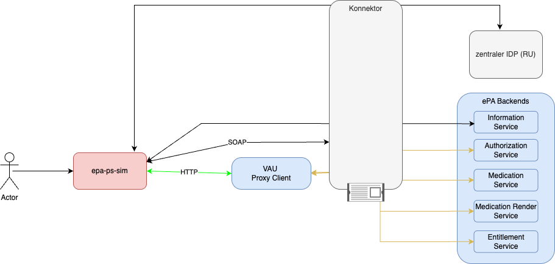

:doctype: book
ifndef::env-github[]
image::Gematik_Logo_Flag_With_Background.png[logo,width=200,height=47,role=right]
endif::[]
ifdef::env-github[]
++++
  
++++
endif::[]

= EPA-PS-SIM

== About The Project

Project to simulate the ePA (health record) use cases from the perspective of a Health Professional Software (HPS). The uses cases can be triggered via the provided REST API.
Currently, the application is supporting the ePA Specification in version *3.0.5*.

=== Overview

=== Prerequisites

To build and run the project from source you need the following software installed on your machine:

* Java 21
* Maven 3.8+
* Git

To run the project as a Docker container you only need:

* Docker

=== Modules

The project consists of the following modules:

* `epa-ps-sim-api` (in this document referred to as "api")
** REST API definitions and OpenAPI specs.
** Provides the endpoints to trigger the different HPS workflows.

* `epa-fm-java-api`
** Java classes generated from ePA Document-Service WSDL, Konnektor related WSDL and the OpenAPI specs from the api module.
** Used by the lib to implement communication with the Konnektor.

* `epa-ps-sim-lib`
** Core library implementing the API logic.
** Transforms the data received from the client into SOAP requests of Konnektor operations, executes the Konnektor operation and transforms the received SOAP response into a response to return to the client
** Makes heavy use of the link:https://github.com/gematik/lib-ihe-xds[lib-ihe-xds] to handle the XDS services.

* `epa-ps-sim-app`
** Spring Boot application exposing the api and using the lib to provide a stand-alone solution

== Feature Set

The PS-SIM application communicates with the ePA backends to enable different use cases:

* Audit Events (including rendering)
* Authorization (User Session of an SM-B identity)
* Consent Decision
* Email Service
* Entitlements (Setting entitlements for an SM-B identity)
* Information Service
* Medications (Retrieve eML as FHIR, PDF or XHTML)
* VAU communication (by using our VAU Client component which is also available at docker hub link:https://hub.docker.com/repository/docker/gematik1/epa-vau-proxy-client/general[VPC])
** When using the VAU Client Proxy, all VAU specific requests are proxied through the VPC to ePA backends.

For further details of the features, check the published specifications at following links:

* XDS-Document: https://github.com/gematik/ePA-XDS-Document
* Medication: https://github.com/gematik/ePA-Medication
* All other services: https://github.com/gematik/ePA-Basic

=== Test Driver API
PS-SIM is offering an external API which can be used to trigger different HPS workflows.
We call this API "Test Driver API". To get an overview of the endpoints of this API you can open the swagger UI after starting the application.
The URL for the swagger documentation is as follows:
http://localhost:9016/services/api-docs

== Build and Run

=== Configuration

* The application can communicate with the ePA backends via a Konnektor.
The configuration for the application is done in the link:./epa-ps-sim-app/src/main/resources/application.yaml[application.yaml] file.
This file contains all necessary settings to connect to the ePA backends and configure the application.

* An alternative way to configure the application is to use environment variables. Especially when running the application with docker (how to run will be explained below).
For that we have provided an example link:./.env[env] file in the root directory of the project. You should change the values in this file to match your environment.

* As the PS-SIM application can communicate with the konnektor, you need to provide the necessary configuration settings for the Konnektor in the `.env` file or by passing them as configurations in the spring-boot style.
** e.g. the configuration `KONNEKTOR_CONNECTION_CONNECTONSTARTUP` makes sure that the connection to the Konnektor is established at application startup. If enabled the application will try to connect to the Konnektor, execute `GetCards` and will fail to start if the connection cannot be established.
** For some configurations are alternative values specified which can be passed as environment variables. For example, the configuration `KONNEKTOR_CONNECTION_BASICAUTHENTICATION_ENABLED` can also be set via the environment variable `BASIC_AUTHENTICATION_ENABLED`.

=== Build and Run from Source

1. Clone the repository:
+
----
git clone <repo-url>
cd epa-ps-sim
----

2. Configure the application:
Before building the project update the link:./epa-ps-sim-app/src/main/resources/application.yaml[application.yaml] file with your configuration settings.

3. Build the project:
+
----
mvn clean install
----

4. Run the application:
+
----
cd epa-ps-sim-app
mvn spring-boot:run
----

5. Access the API at `http://localhost:9016/services/api-docs` to view the OpenAPI documentation of all provided endpoints to trigger the different HPS workflows.

=== Run as Docker Container
You can also run the application as a Docker container. The docker image is available under link:https://hub.docker.com/repository/docker/gematik1/epa-ps-sim/general[docker hub].
To run the application as a Docker container, follow these steps:

1. Pull the Docker image (with the desired tagname):
+
----
docker pull gematik1/epa-ps-sim:tagname
----

2. Configure the application:
You can use the provided `.env` file including the configuration settings for the application. Update it based on your needs.

3. Run the Docker container (by passing the environment variables from the `.env` file):
+
----
docker run -p 8080:8080 gematik1/epa-ps-sim:tagname --env-file ./.env
----

== License

Copyright 2023 gematik GmbH

Apache License, Version 2.0

See the `link:./LICENSE[LICENSE]` for the specific language governing permissions and limitations under the License

== Additional Notes and Disclaimer from gematik GmbH

. Copyright notice: Each published work result is accompanied by an explicit statement of the license conditions for use. These are regularly typical conditions in connection with open source or free software. Programs described/provided/linked here are free software, unless otherwise stated.
. Permission notice: Permission is hereby granted, free of charge, to any person obtaining a copy of this software and associated documentation files (the "Software"), to deal in the Software without restriction, including without limitation the rights to use, copy, modify, merge, publish, distribute, sublicense, and/or sell copies of the Software, and to permit persons to whom the Software is furnished to do so, subject to the following conditions:
.. The copyright notice (Item 1) and the permission notice (Item 2) shall be included in all copies or substantial portions of the Software.
.. The software is provided "as is" without warranty of any kind, either express or implied, including, but not limited to, the warranties of fitness for a particular purpose, merchantability, and/or non-infringement. The authors or copyright holders shall not be liable in any manner whatsoever for any damages or other claims arising from, out of or in connection with the software or the use or other dealings with the software, whether in an action of contract, tort, or otherwise.
.. The software is the result of research and development activities, therefore not necessarily quality assured and without the character of a liable product. For this reason, gematik does not provide any support or other user assistance (unless otherwise stated in individual cases and without justification of a legal obligation). Furthermore, there is no claim to further development and adaptation of the results to a more current state of the art.
. Gematik may remove published results temporarily or permanently from the place of publication at any time without prior notice or justification.
. Please note: Parts of this code may have been generated using AI-supported technology. Please take this into account, especially when troubleshooting, for security analyses and possible adjustments.

== Contact

link:https://www.gematik.de/[gematik GmbH], OSPO@gematik.de
